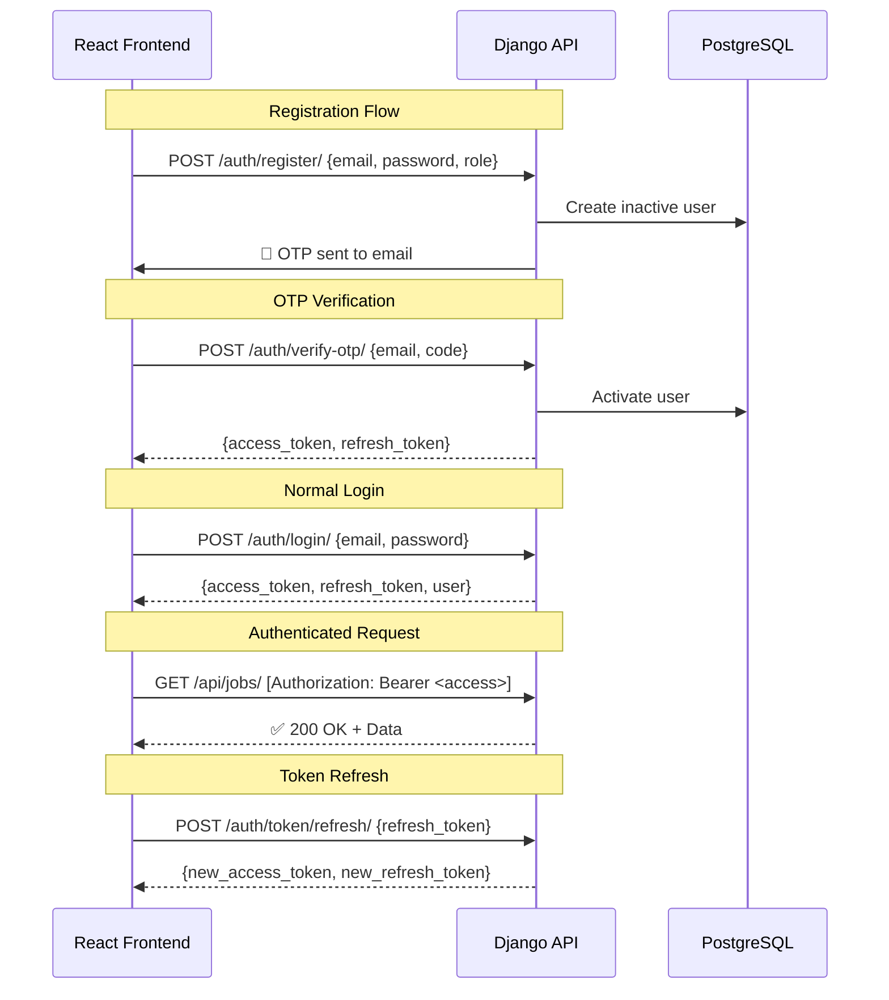

# GradLink Authentication Architecture Report

> **Project:** GradLink (Django REST Framework)  
> **Date:** March 3, 2026  
> **Scope:** Authentication mechanism analysis, comparison, and justification

---

## 1. Authentication Type Used: **JWT (JSON Web Tokens) via SimpleJWT**

GradLink uses **`djangorestframework-simplejwt`** as its primary authentication backend. This is a stateless, token-based authentication system that issues two types of tokens:

| Token | Purpose | Lifetime (Configured) |
|---|---|---|
| **Access Token** | Sent with every API request in the `Authorization: Bearer <token>` header to prove identity | **60 minutes** |
| **Refresh Token** | Used to obtain a new access token without re-entering credentials | **1 day** |

### How It Works in GradLink



### Configuration in [settings.py](file:///c:/Users/fadyb/OneDrive/Desktop/projects/grandlink/core/settings.py)

```python
REST_FRAMEWORK = {
    'DEFAULT_AUTHENTICATION_CLASSES': (
        'rest_framework_simplejwt.authentication.JWTAuthentication',
    ),
}

SIMPLE_JWT = {
    'ACCESS_TOKEN_LIFETIME': timedelta(minutes=60),
    'REFRESH_TOKEN_LIFETIME': timedelta(days=1),
    'ROTATE_REFRESH_TOKENS': True,        # New refresh token on each refresh
    'BLACKLIST_AFTER_ROTATION': True,      # Old refresh tokens are blacklisted
}
```

### Additional Auth Features Implemented

| Feature | Implementation |
|---|---|
| **Email-based login** | Custom [User](file:///c:/Users/fadyb/OneDrive/Desktop/projects/grandlink/authentication/models.py#38-74) model with [email](file:///c:/Users/fadyb/OneDrive/Desktop/projects/grandlink/authentication/utils.py#16-48) as `USERNAME_FIELD` (no username) |
| **OTP Email Verification** | 6-digit OTP sent via SMTP, stored in [OTPVerification](file:///c:/Users/fadyb/OneDrive/Desktop/projects/grandlink/authentication/models.py#76-98) model with expiry & attempt limits |
| **Google OAuth2 SSO** | Server-side Google token verification → auto-create/login user → issue JWT |
| **Role-based access** | User roles: `student`, `employer`, `admin` |
| **Soft delete** | [soft_delete()](file:///c:/Users/fadyb/OneDrive/Desktop/projects/grandlink/authentication/models.py#63-68) / [reactivate()](file:///c:/Users/fadyb/OneDrive/Desktop/projects/grandlink/authentication/models.py#69-74) methods with 30-day window |
| **Token rotation** | Refresh tokens are rotated and old ones blacklisted |

---

## 2. Comparison with Other Authentication Methods

### 2.1 Session-Based Authentication (Django Default)

| Aspect | Session Auth | JWT (SimpleJWT) ✅ |
|---|---|---|
| **State** | **Stateful** — session stored server-side (DB / cache) | **Stateless** — token is self-contained |
| **Storage** | Server stores session in DB; client holds `sessionid` cookie | Server stores nothing*; client holds token |
| **Scalability** | ❌ Every request hits DB to validate session | ✅ Token validated by signature only — no DB hit |
| **Cross-domain** | ❌ Cookies are domain-locked; hard with separate frontend | ✅ Token sent in header; works across any domain |
| **Mobile / SPA** | ❌ Cookies awkward on mobile & single-page apps | ✅ Perfect fit for React SPA + mobile apps |
| **CSRF** | ❌ Requires CSRF protection for cookies | ✅ No cookies = no CSRF vulnerability |
| **Logout** | ✅ Simple server-side invalidation | ⚠️ Requires blacklisting (GradLink has this) |

> \* *With `BLACKLIST_AFTER_ROTATION=True`, GradLink does store blacklisted refresh tokens, but this is a lightweight operation.*

### 2.2 Token Authentication (DRF's Built-in `TokenAuthentication`)

| Aspect | DRF TokenAuth | JWT (SimpleJWT) ✅ |
|---|---|---|
| **Token type** | Single permanent token per user | Paired access + refresh tokens |
| **Expiration** | ❌ **No built-in expiration** — token is valid forever | ✅ Access token auto-expires (60 min) |
| **DB dependency** | ❌ Every request queries the `authtoken_token` table | ✅ Access token verified by cryptographic signature |
| **Security** | ❌ If stolen, token is valid indefinitely | ✅ Short-lived access token limits damage window |
| **Rotation** | ❌ Manual implementation needed | ✅ Built-in refresh rotation + blacklisting |
| **Payload** | ❌ No payload — just an opaque string | ✅ JWT contains claims (user ID, role, expiry) |

### 2.3 OAuth2 / Third-Party Providers Only

| Aspect | OAuth2 Only | JWT + OAuth2 (GradLink's approach) ✅ |
|---|---|---|
| **Provider dependency** | ❌ 100% dependent on Google/Facebook uptime | ✅ JWT works independently; Google is optional |
| **Local accounts** | ❌ Cannot support email/password registration | ✅ Supports both local + Google sign-in |
| **Complexity** | ❌ Complex OAuth flows for every request | ✅ OAuth only at login; JWT for all subsequent requests |
| **Offline access** | ❌ Requires constant provider connectivity | ✅ JWT validated locally |

### 2.4 API Key Authentication

| Aspect | API Key | JWT (SimpleJWT) ✅ |
|---|---|---|
| **Use case** | Machine-to-machine / 3rd party integrations | User-facing applications |
| **Identity** | ❌ Identifies the application, not the user | ✅ Token carries user identity (ID, role) |
| **Expiration** | ❌ Typically permanent | ✅ Auto-expiring with rotation |
| **Granularity** | ❌ One key per service | ✅ Per-user tokens with role-based permissions |

### 2.5 Summary Comparison Matrix

| Feature | Session | DRF Token | API Key | OAuth2 Only | **JWT (SimpleJWT)** ✅ |
|---|---|---|---|---|---|
| Stateless | ❌ | ❌ | ❌ | ❌ | ✅ |
| Auto-expiration | ✅ | ❌ | ❌ | ✅ | ✅ |
| SPA-friendly | ❌ | ✅ | ✅ | ⚠️ | ✅ |
| Mobile-friendly | ❌ | ✅ | ✅ | ⚠️ | ✅ |
| No CSRF needed | ❌ | ✅ | ✅ | ✅ | ✅ |
| Carries user data | ❌ | ❌ | ❌ | ✅ | ✅ |
| Scalable | ❌ | ❌ | ✅ | ⚠️ | ✅ |
| Works cross-domain | ❌ | ✅ | ✅ | ✅ | ✅ |

---

## 3. Why JWT (SimpleJWT) Is the Best Fit for GradLink

### 3.1 Architecture Match: Django + React SPA

GradLink's architecture is a **Django REST API backend** with a **React frontend** running on separate domains/ports (`localhost:8000` vs `localhost:3000`). This is the textbook use case for JWT:

- **Cross-origin by design** — JWT tokens are sent via `Authorization` headers, not cookies, so CORS is straightforward.
- **No session infrastructure needed** — The React app stores tokens in memory/localStorage and attaches them to every request.
- **No CSRF vulnerabilities** — Since no cookies are used for auth, CSRF attacks are not applicable.

### 3.2 Performance & Scalability

- **Zero DB queries for authentication** — Every incoming request is validated by verifying the JWT signature using the `SECRET_KEY`. No database roundtrip.
- **Horizontal scaling** — Any server instance can validate any token. No shared session store (e.g., Redis) needed for auth.
- **Ideal for high-traffic endpoints** — Job listings, ATS operations, and profile queries are authenticated without DB overhead.

### 3.3 Security Features Already Implemented

GradLink has leveraged SimpleJWT's security features correctly:

| Security Feature | Status | Impact |
|---|---|---|
| **Short access token lifetime (60 min)** | ✅ Configured | Limits exposure if token is stolen |
| **Refresh token rotation** | ✅ `ROTATE_REFRESH_TOKENS=True` | Every refresh issues a new pair, preventing reuse |
| **Blacklisting old tokens** | ✅ `BLACKLIST_AFTER_ROTATION=True` | Stolen refresh tokens become invalid after rotation |
| **OTP email verification** | ✅ Custom implementation | Prevents fake accounts; verifies email ownership |
| **Google OAuth2 integration** | ✅ Server-side verification | Trusted identity from Google without storing Google passwords |
| **Password validation** | ✅ Django validators enabled | Enforces strong passwords |

### 3.4 Multi-Role System Compatibility

GradLink has three distinct user roles: `student`, `employer`, and `admin`. JWT naturally supports this because:

- The token payload carries the user ID, which maps to a role in the database.
- Role-based permission classes can be applied per-view without additional auth queries.
- Different frontends (student dashboard, employer portal, admin panel) can all use the same JWT mechanism.

### 3.5 Mobile-Ready

If GradLink ever expands to mobile apps (iOS/Android), JWT works out of the box:

- Tokens are stored in secure device storage.
- No cookie management or WebView session hacks.
- Same API, same auth headers, same backend — zero changes needed.

---

## 4. Potential Improvements

> [!TIP]
> These are recommendations for further hardening, not issues with the current choice.

| Improvement | Rationale |
|---|---|
| **Store tokens in `httpOnly` cookies** (optional) | Prevents XSS from accessing tokens in localStorage. SimpleJWT supports this pattern. |
| **Add `jti` claim checking** | Track individual token IDs for per-token revocation. |
| **Implement sliding sessions** | Automatically extend active users' sessions by issuing new tokens on activity. |
| **Add rate limiting on login/OTP** | Prevent brute-force attacks on the login and OTP endpoints. |
| **Consider `RS256` signing** | Allows public key verification by microservices without sharing the secret key. |

---

## 5. Conclusion

**JWT via SimpleJWT is the optimal authentication strategy for GradLink** because:

1. ✅ It is **purpose-built** for Django REST + React SPA architectures.
2. ✅ It provides **stateless, scalable authentication** with zero DB overhead per request.
3. ✅ It supports **cross-origin requests** natively — essential for separate frontend/backend deployments.
4. ✅ The **token rotation and blacklisting** features are already configured, providing strong security.
5. ✅ It seamlessly integrates with **Google OAuth2 SSO** as an additional login method.
6. ✅ It's **mobile-ready** for future platform expansion.
7. ✅ It's the **industry standard** for modern API authentication, with strong community support and documentation.

No other authentication method checks all these boxes for GradLink's specific requirements.
